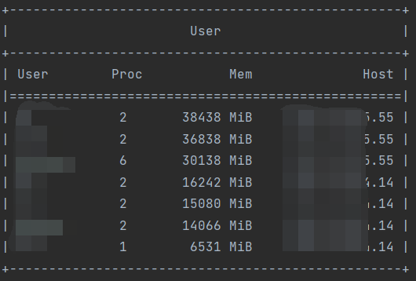
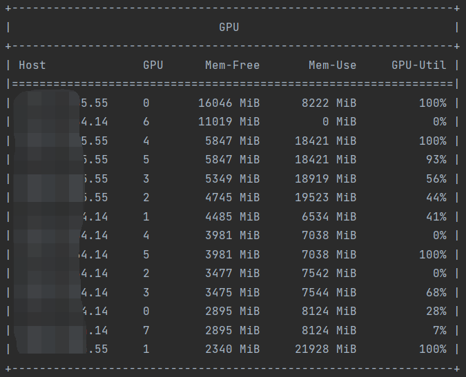

# Nvidia-smi Monitor

This is a simple script to monitor multiple GPUs on **multiple** machines with help of ssh
lib [paramiko](https://github.com/paramiko/paramiko).

## Introduction

With the motivation to find a free GPU among multiple servers easily and to check other colleagues' GPU usage,
the script was written to provide

+ detailed information of processes running on GPUs

  e.g. username, elapse time

+ summary of users' processes

  e.g. number of processes, total memory usage

  

+ summary of GPUs' usage

  e.g. free memory

  

## Usage

To establish ssh connection with GPU servers, `host`, `username` and `password` are required. 
The following are ways to provide the information.

1. Use `server.json`. You can select the index of the server you want to monitor.

   ```json
   [
         {
              "host": "server1",
              "username": "user1",
              "password": "password1"
         },
         {
              "host": "server2",
              "username": "user2",
              "password": "password2"
         },
         {
              "host": "server3",
              "username": "user3",
              "password": "password3"
         }
    ]
    ```

    ```bash
      python main.py server.json --index 0,2
    ```

2. Use command line arguments.

    ```bash
      python main.py user1:pass1@host1 user2:pass2@host2 ...
    ```